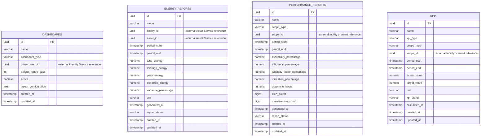

# Analytics Service ER Diagram

The service deliberately contains no database foreign keys to users, facilities, assets, sensors, alerts, or work orders. IDs belonging to other services are external references only.

The four aggregates are intentionally independent. A generated report is a historical snapshot, while a KPI can be managed independently and a dashboard stores presentation configuration only.
