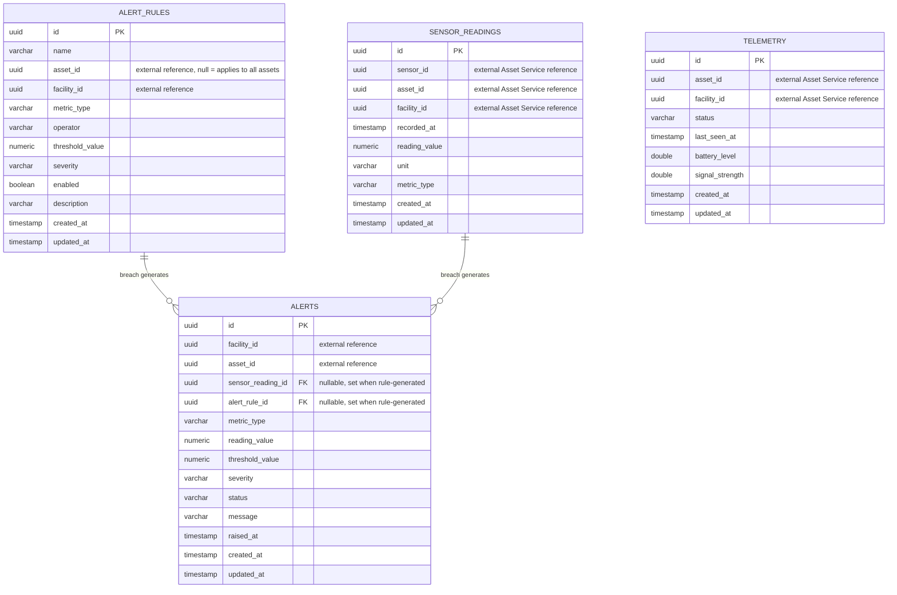

# Monitoring Service ER Diagram

The service owns `monitoring_db` exclusively. `sensorId`, `assetId`, and `facilityId` are external references to the Asset Service — stored as plain UUID columns with no foreign key constraints, per REOAGMS's microservice data-ownership rule.

## Notes

- `SensorReading` is the raw metric stream (temperature, voltage, power, etc.) written by field devices or a simulator.
- `Telemetry` is a separate, lower-frequency connectivity/heartbeat signal used to tell whether an asset's monitoring hardware is online — it is not a metric value and is not evaluated against `AlertRule`.
- `AlertRule` defines a threshold condition per metric type (optionally scoped to one asset); `Alert` is either raised automatically whenever a `SensorReading` breaches an enabled rule, or manually via `POST /api/v1/alerts`.
- `alert_rule_id` / `sensor_reading_id` on `Alert` are nullable because manually-raised alerts have no originating rule or reading.
