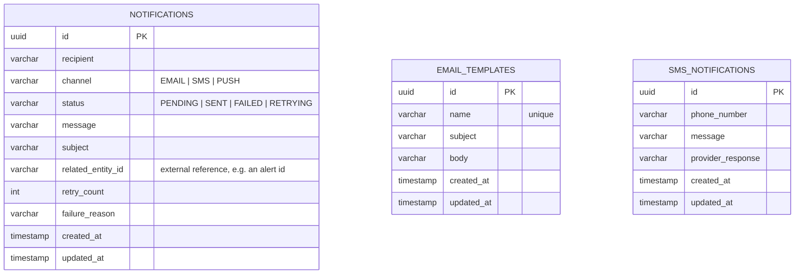

# Notification Service ER Diagram

The service contains no database foreign keys to other services' data. `relatedEntityId` on `notifications` is a free-text external reference only (e.g. an alert id from Monitoring), not a foreign key.

The three tables are intentionally independent — there is no foreign key between `sms_notifications`/`email_templates` and `notifications`. `SmsNotification` is a dispatch-side log written by `SmsDispatcher` for each SMS send attempt; `EmailTemplate` is reusable content managed via its own CRUD API and not yet wired to `Notification` creation (see README §10 — known limitation).
